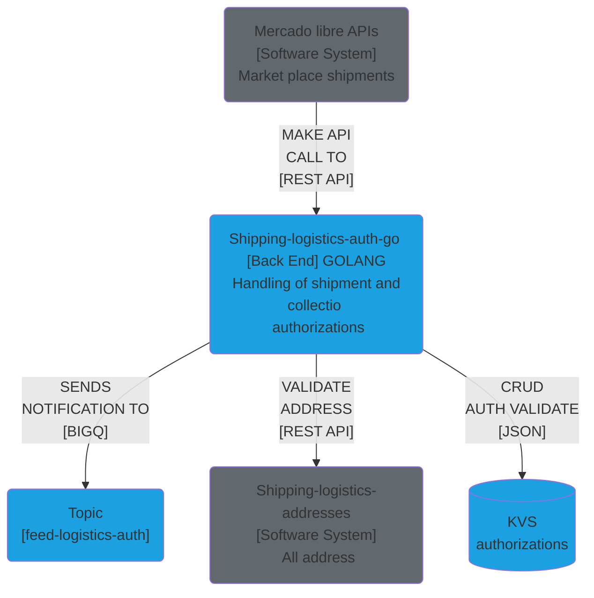

# clase7

```mermaid
  flowchart TD;
    classDef SLAGclass fill:#1BA1E2;
    SLAG(Shipping-logistics-auth-go <br/> &#91Back End&#93 GOLANG <br/> Handling of shipment and collectio <br/> authorizations);
    classDef Extclass fill:#61686E;
    SLA(Shipping-logistics-addresses<br/> &#91Software System&#93 <br/> All address);
    KVS[(KVS <br/> authorizations)];
    ML(Mercado libre APIs<br/> &#91Software System&#93 <br/> Market place shipments);
    BIGQ(Topic <br/> &#91feed-logistics-auth&#93);
    ML:::Extclass -- MAKE API <br/> CALL TO <br/> &#91REST API&#93 --> SLAG:::SLAGclass;
    SLAG:::SLAGclass -- SENDS <br/> NOTIFICATION TO <br/> &#91BIGQ&#93 --> BIGQ:::SLAGclass;
    SLAG:::SLAGclass -- VALIDATE <br/> ADDRESS <br/> &#91REST API&#93 --> SLA:::Extclass;
    SLAG:::SLAGclass -- CRUD <br/> AUTH VALIDATE <br/> &#91JSON&#93 --> KVS:::SLAGclass;
```
